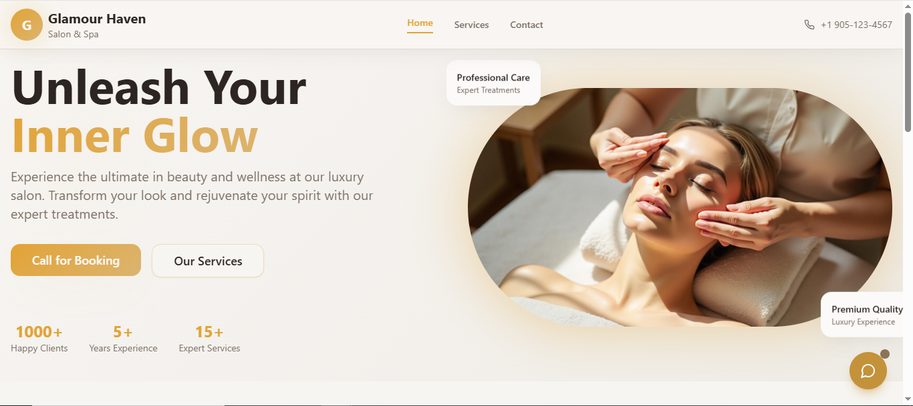
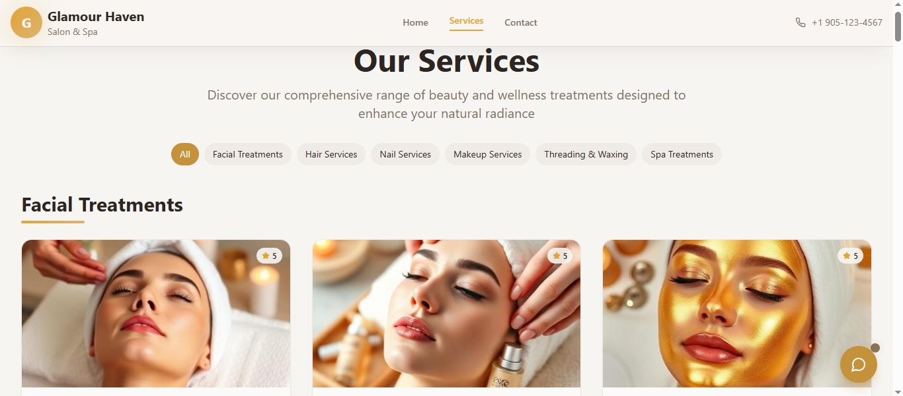
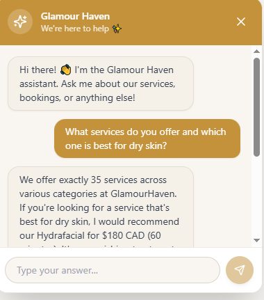
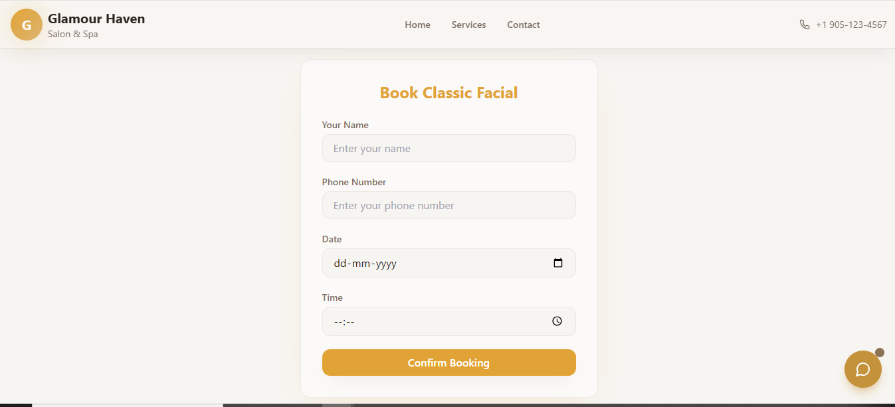
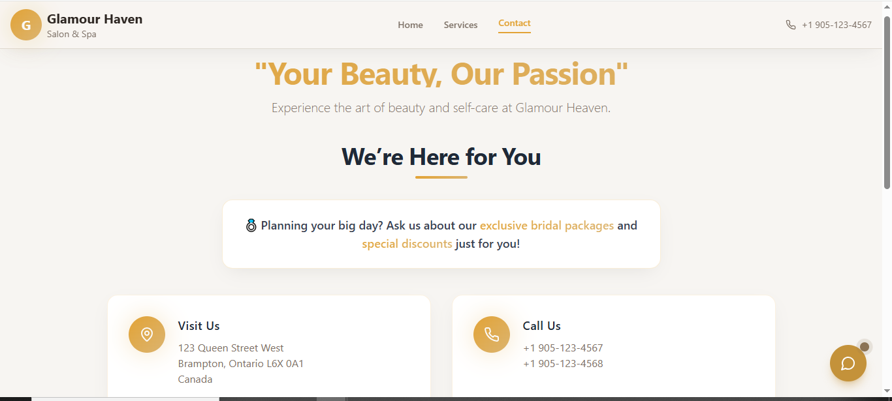
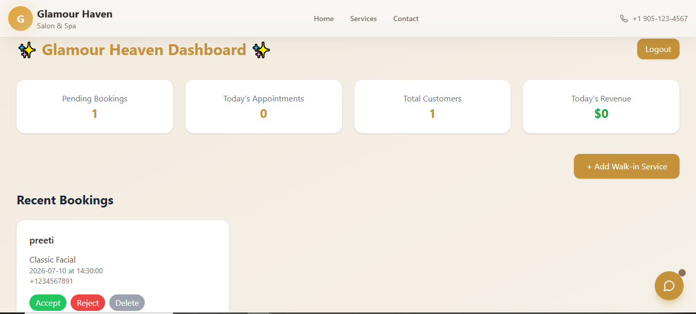
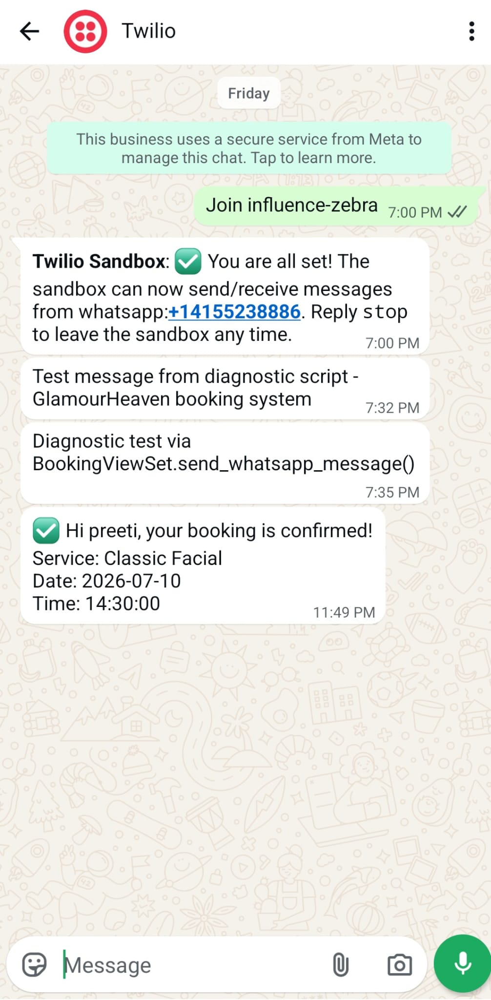

# ✨ GlamourHaven – Service Booking Website  

**GlamourHaven** is a full-stack service booking platform that allows **customers** to book salon/spa services online, while enabling **staff/admins** to manage those bookings through a secure dashboard.The system also features an **AI-powered chatbot** that assists customers with service information and booking guidance in real time. 

The system is built with a **React frontend** and a **Django backend**, seamlessly connected via **REST APIs**.  

---

## 🌐 Live Links

- 🌸 **Customer Booking Page:** [glamourheaven.netlify.app](https://glamourheaven.netlify.app)
- 👩‍💼 **Admin Dashboard (Login Required):** [glamourheaven.netlify.app/dashboard](https://glamourheaven.netlify.app/dashboard)  
  **💡 Demo Credentials:**  
  &nbsp;&nbsp;• **Username:** `dell`  
  &nbsp;&nbsp;• **Password:** `admin123`
- ⚙️ **Backend API Root (Developer Only):** [glamourheaven-backend.onrender.com](https://glamourheaven-backend.onrender.com)
- 📊 **Bookings API:** [glamourheaven-backend.onrender.com/api/bookings/](https://glamourheaven-backend.onrender.com/api/bookings/)
- 🤖 **Chat API:** https://glamourheaven-backend.onrender.com/api/chat/

---

## ✨ Features  

### 👩‍💻 For Customers  
- ✅ Browse and book **salon/spa services**  
- ✅ Simple & responsive **booking form**  
- ✅ Smooth, modern **UI/UX** (desktop & mobile)
- ✅ **AI Chatbot assistant** — ask about services, prices & bookings in real time
- ✅ **Book directly through the AI chatbot** — complete a full booking (service, date, time, name & phone) via conversation, with the same confirmation and WhatsApp notification as the regular booking form

- ## 📸 Screenshots

### Home

### Services

### AI Chatbot

### Booking Form

### Contact

### Dashboard

### WhatsApp Notification

### 🛠️ For Staff/Admins  
- ✅ **Dashboard** to view all bookings  
- ✅ **Accept / Reject** bookings in one click  
- ✅ Add **manual bookings** (walk-in customers)  
- ✅ **WhatsApp notifications** via Twilio API (on accept/reject)  
- ✅ Secure **login-protected dashboard** (APIs locked without authentication)  

---

## 🛠️ Tech Stack  

- 🎨 **Frontend**: React 18 with TypeScript, React Router v6, TanStack Query, React Hook Form + Zod, Tailwind CSS, shadcn/ui + Radix UI, Lucide Icons, Vite → *(Deployed on Netlify)*  
- ⚙️ **Backend**: Django + Django REST Framework, Token-Based Authentication, SQLite3, python-dotenv → *(Deployed on Render)*  
- 💬 **Messaging**: Twilio API (WhatsApp notifications)  
- 🤖 **AI Integration**: Groq API (Llama 3 model, free tier), real-time AI-powered salon assistant chatbot, Django REST endpoint (`/api/chat/`) → *(Built using Claude Code CLI + MCP)*  
- 🔗 **Integration**: REST APIs (Frontend ↔ Backend), protected endpoints, CORS configured, environment variables for secure API key management

---

## 🚀 Deployment Workflow  
- 🌍 **Frontend** hosted on **Netlify**  
- ⚡ **Backend** hosted on **Render**  
- 🔗 Connected via **REST APIs**
- 🤖 AI powered by **Groq API (free tier)**  

---

## 📌 API Documentation

Below is a list of all main REST API endpoints available in the backend:

| Endpoint | Method | Description |
|----------|---------|-------------|
| `/` | GET | Root welcome message |
| `/admin/` | - | Django Admin site |
| `/api/token/auth/` | POST | Obtain authentication token (login) |
| `/api/bookings/` | GET | List all bookings (Auth required) |
| `/api/bookings/` | POST | Create a new booking (Public allowed) |
| `/api/bookings/{id}/` | DELETE | Delete a booking (Auth required) |
| `/api/bookings/{id}/accept/` | POST | Accept a booking & send WhatsApp notification |
| `/api/bookings/{id}/reject/` | POST | Reject a booking & send WhatsApp notification |
| /api/chat/ | POST | AI chatbot endpoint — send message, get response |

“Other RESTful endpoints (GET single booking, PATCH update booking) are available via ModelViewSet, but are not used in the current frontend flow.”

### 🔄 API Flow Overview

**Customer (Frontend)**  
→ [Create Booking] → /api/bookings/ (POST)  
→ [Chat with AI] → /api/chat/ (POST) → Groq API → Response  

**Admin (Dashboard)**  
→ [Login] → /api/token/auth/ (POST)  
→ [View Bookings] → /api/bookings/ (GET)  
→ [Delete Booking] → /api/bookings/{id}/ (DELETE)  
→ [Accept Booking] → /api/bookings/{id}/accept/ (POST)  
→ [Reject Booking] → /api/bookings/{id}/reject/ (POST)  
✅ On Accept/Reject → WhatsApp Notification sent via Twilio API  

**AI Chatbot Flow**  
→ Customer types message in chat widget  
→ React frontend sends POST to /api/chat/  
→ Django backend forwards to Groq API (Llama 3)  
→ AI response returned to customer in real time  

---

## 📌 Summary  
This project delivers a **complete AI-powered salon booking solution**, featuring:  
- 🌸 A **customer-facing booking platform**  
- 👩‍💼 A **secure admin dashboard**
- 🤖 An **AI chatbot assistant** powered by Groq API  
- 🔗 **API-driven integration** with authentication & notifications  

✨ A showcase of **full-stack development, AI integration, REST APIs, authentication, and third-party service integration**.
